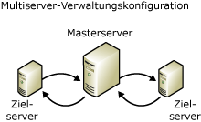

# Automatisierte Verwaltung in einem Unternehmen
Automatisieren der Verwaltung über mehrere Instanzen von [!INCLUDE[ssNoVersion](../content/includes/ssNoVersion_md.md)] heißt *Multiserveradministration*. Verwenden Sie die Multiserveradministration für folgende Aufgaben:  
  
-   Verwalten von zwei oder mehr Servern.  
  
-   Erstellen von Zeitplänen für den Informationsfluss zwischen Unternehmensservern für Dataware Housing.  
  
Für die Multiserveradministration benötigen Sie mindestens einen Masterserver und mindestens einen Zielserver. Ein Masterserver verteilt Aufträge an die Zielserver und empfängt Ereignisse von ihnen. Auf dem Masterserver ist zudem die zentrale Kopie der Auftragsdefinitionen für Aufträge gespeichert, die auf Zielservern ausgeführt werden. Zielserver stellen in regelmäßigen Abständen Verbindungen mit dem Masterserver her, um den Zeitplan der Aufträge zu aktualisieren. Ist ein neuer Auftrag auf dem Masterserver vorhanden, lädt der Zielserver den Auftrag herunter. Nach dem Beenden des Auftrags stellt der Zielserver erneut eine Verbindung mit dem Masterserver her und berichtet den Status des Auftrags. Beachten Sie, dass Ihre Auftragsdefinition identisch, beim Ausführen einer beliebigen Datenbank sein muss verwandten Aktivitäten.  
  
Die folgende Abbildung stellt die Beziehung zwischen Master- und Zielserver dar:  
  
  
  
Wenn Sie Abteilungsserver in einem großen Unternehmen verwalten, können Sie Folgendes definieren:  
  
-   Einen Sicherungsauftrag mit Auftragsschritten.  
  
-   Operatoren, die bei einem Sicherungsfehler zu benachrichtigen sind.  
  
-   Einen Ausführungszeitplan für den Sicherungsauftrag.  
  
Richten Sie diesen Sicherungsauftrag einmal auf dem Masterserver ein, und tragen Sie anschließend alle Abteilungsserver als Zielserver ein. Ab dem Zeitpunkt der Eintragung können alle Abteilungsserver denselben Sicherungsauftrag ausführen, obwohl Sie ihn nur ein einziges Mal definiert haben.  
  
> [!NOTE]  
> Die Funktionen der Multiserveradministration sind für Mitglieder der sysadmin-Serverrolle bestimmt. Ein Mitglied der sysadmin-Rolle auf dem Zielserver kann jedoch die Vorgänge nicht bearbeiten, die auf dem Zielserver vom Masterserver ausgeführt werden. Durch diese Sicherheitsmaßnahme soll das versehentliche Löschen von Auftragsschritten und die Unterbrechung von Operationen auf dem Zielserver verhindert werden.  
  
## In diesem Abschnitt  
[Erstellen einer Multiserverumgebung](../content/Create-a-Multiserver-Environment.md)  
Enthält Informationen zum Erstellen und Verwalten von Master- und Zielservern.  
  
[Auswählen des richtigen SQL Server-Agent-Dienstkontos für Multiserverumgebungen](../content/Choose-the-Right-SQL-Server-Agent-Service-Account-for-Multiserver-Environments.md)  
Enthält Informationen dazu, wie sich die Verwendung von Windows-Konten ohne Administratorberechtigungen oder des Kontos LocalSystem für den [!INCLUDE[ssNoVersion](../content/includes/ssNoVersion_md.md)]-Agent-Dienst auf Multiserverumgebungen auswirken kann.  
  
[Festlegen von Verschlüsselungsoptionen auf Zielservern](../content/Set-Encryption-Options-on-Target-Servers.md)  
Enthält Informationen zum Festlegen der MsxEncryptChannelOptions[!INCLUDE[ssNoVersion](../content/includes/ssNoVersion_md.md)] Agent-Registrierungsunterschlüssels auf Zielservern.  
  
[Verwalten von Aufträgen über ein gesamtes Unternehmen](../content/Manage-Jobs-Across-an-Enterprise.md)  
Enthält Informationen zum Überprüfen des Auftragsstatus, Ändern der Zielserver für Aufträge, Synchronisieren von Zielserveruhren, Abrufen des aktuellen Auftragsstatus von Masterservern.  
  
[Problembehandlung von proxybasierten Multiserveraufträgen](../content/Troubleshoot-Multiserver-Jobs-That-Use-Proxies.md)  
Enthält Informationen zur Problembehandlung von Multiserveraufträgen, die Proxys verwenden, bei denen ein Fehler auftritt.  
  
[Abfragen von Servern](../content/Poll-Servers.md)  
Enthält Informationen zum impliziten und expliziten Abfragen des Masterservers durch Zielserver zum Synchronisieren von Auftragsinformationen.  
  
[Verwalten von Ereignissen](../content/Manage-Events.md)  
Enthält Informationen zur Weiterleitung von Ereignissen von den Zielservern auf die Masterserver.  
  
[Optimieren der automatischen Verwaltung in einem Unternehmen](../content/Tune-Automated-Administration-Across-an-Enterprise.md)  
Enthält Informationen dazu, wie die automatisierte Verwaltung in einer Umgebung mit mehreren Servern nutzt selbst\-Funktionen des Datenbankoptimierungsratgebers [!INCLUDE[ssNoVersion](../content/includes/ssNoVersion_md.md)].  
  
## Siehe auch  
[Themen zur Abwärtskompatibilität für die Installation von SQL Server-Datenbankmoduls](assetId:///10de5ec6-d3cf-42ef-aa62-1bdf3fbde841)  
[Registrieren von Servern](assetId:///c2a2513e-fa09-419c-99e7-a12d57c5a0db)  
[sp_add_targetservergroup](assetId:///acb69343-d766-46ff-b771-0c7655c5231a)  
[sp_delete_targetserver](assetId:///cc438701-ad91-419d-9f23-ebc4c548c700)  
[sp_delete_targetservergroup](assetId:///d8dd838e-64aa-419f-9ccb-ff04908cf3e4)  
[sp_help_downloadlist](assetId:///745b265b-86e8-4399-b928-c6969ca1a2c8)  
[sp_help_jobserver](assetId:///57971787-f9f5-4199-9f64-c2b61a308906)  
[sp_help_targetservergroup](assetId:///ec3a4a68-b591-431c-9518-053ede522d0c)  
[sp_resync_targetserver](assetId:///40e44df7-d3e3-44ee-b149-08aba629a21f)  
[sp_update_targetservergroup](assetId:///4ac65ed6-e07e-40e4-a282-13bfd92dfa41)  
[sysjobservers](assetId:///9abcc20f-a421-4591-affb-62674d04575e)  
[syslogins](assetId:///4cb34f17-a4bb-469f-a218-71f074e6308f)  
[systargetservers](assetId:///479d1314-be37-4d19-ac9c-419fc9110e53)  
  
