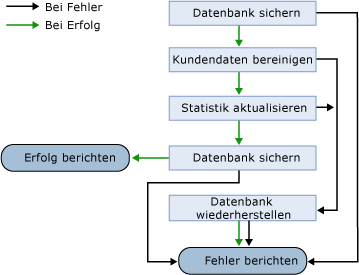

# Handhaben Sie mehrerer Auftragsschritte
Wenn der Auftrag mehr als einen Auftragsschritt aufweist, müssen Sie die Reihenfolge angeben, in der die Auftragsschritte ausgeführt. Dies wird als *ablaufsteuerung**.* Sie können neue Auftragsschritte hinzufügen und den Ablauf der Auftragsschritte neu anzuordnen, zu einem beliebigen Zeitpunkt. die Änderungen wirksam das nächste Mal, das der Auftrag ausgeführt wird. Diese Abbildung zeigt die Steuerung der Ablauf für einen Sicherungsauftrag für die Datenbank.  
  
  
  
Der erste Schritt ist die Datenbank sichern. Wenn dieser Schritt fehlschlägt, [!INCLUDE[ssNoVersion](../content/includes/ssNoVersion_md.md)] Agent meldet einen Fehler an den Operator aus, die Benachrichtigung definiert ist. Wenn die Backup Database-Schritt erfolgreich ist, wird der Auftrag mit dem nächsten Schritt, "Scrub" Kundendaten fortgesetzt. Wenn dieser Schritt fehlschlägt, [!INCLUDE[ssNoVersion](../content/includes/ssNoVersion_md.md)] Agent springt vorwärts zu Restore Database. Wenn "Bereinigen" Kundendaten erfolgreich ist, wird vom Auftrag der nächste Schritt, Update Statistics usw., bis der letzte Schritt entweder Ergebnisse im Bericht Erfolg oder melden des Fehlers.  
  
Sie definieren ein Steuerelement\-von\-Aktion für den Erfolg und Fehlschlagen eines Auftragsschrittes fließen. Sie müssen angeben, eine Aktion, die ausgeführt werden, wenn ein Auftragsschritt erfolgreich ausgeführt wird und eine Aktion, die ausgeführt werden, wenn ein Auftragsschritt fehlschlägt. Sie können auch die Anzahl der Wiederholungsversuche für den fehlgeschlagenen Auftragsschritten und das Intervall zwischen den Wiederholungsversuchen definieren.  
  
> [!NOTE]  
> Bei Verwendung der [!INCLUDE[ssNoVersion](../content/includes/ssNoVersion_md.md)] GUI-Agent-Benutzeroberfläche (GUI) aus und Löschen einen oder mehrere Schritte eines Auftrags, die GUI entfernt alle Auftragsschritte und fügt dann die verbleibenden Schritte mit dem richtigen auf\-Erfolg oder\-Fehler verweisen. Nehmen wir beispielsweise an, Sie haben ein Projekt mit fünf Schritten und der erste Schritt ist so konfiguriert, dass Sie zu Schritt 4 springen, wenn er erfolgreich abgeschlossen wird. Wenn Sie Schritt 3 löschen, wird die GUI alle Schritte für diesen Auftrag entfernt und fügt die verbleibenden vier Schritte (1, 2, 4 und 5) mit den korrigierten verweisen. In diesem Fall würde der Verweis in Schritt 1 neu konfiguriert werden, wechseln Sie zu Schritt 3 bei erfolgreichem Abschluss von Schritt 1.  
  
Auftragsschritte müssen selbst werden\-enthalten sind. Ein Auftrag kann nicht, also boolesche Werte, Daten oder numerischen Werte zwischen den Auftragsschritten übergeben. Sie können allerdings Werte übergeben, von einem [!INCLUDE[tsql](../content/includes/tsql_md.md)] Auftragsschritt zu einem anderen mithilfe von dauerhaften Tabellen oder globalen temporären Tabellen. Sie können Werte von Auftragsschritten übergeben, die mithilfe von Dateien ausführbare Programme von einem Auftragsschritt zu einem anderen Auftragsschritt ausgeführt. Z. B. die ausführbare Datei ausführen durch einen Auftragsschritt schreibt eine Datei, und die ausführbare Datei ausführen, von einem nachfolgenden Auftragsschritt liest die Datei.  
  
> [!NOTE]  
> Wenn Sie die Schleife Auftragsschritte erstellen (Auftragsschritt 1 folgt Auftragsschritt 2, dann kehrt Auftragsschritt 2 zu Auftragsschritt 1 zurück), wird eine Warnung angezeigt, wenn Sie der Auftrag mit [!INCLUDE[ssManStudioFull](../content/includes/ssManStudioFull_md.md)].  
  
[!INCLUDE[ssNoVersion](../content/includes/ssNoVersion_md.md)] Datensätze Agentauftrag Informationen und Auftragsschritten im Auftragsverlauf.  
  
## Siehe auch  
[sp_add_job](assetId:///6ca8fe2c-7b1c-4b59-b4c7-e3b7485df274)  
[sysjobhistory](assetId:///1b1fcdbb-2af2-45e6-bf3f-e8279432ce13)  
[Sysjobs (Transact-SQL)](assetId:///e244a6a5-54c2-47a6-8039-dd1852b0ae59)  
[sysjobsteps](assetId:///978b8205-535b-461c-91f3-af9b08eca467)  
[Implementieren von Aufträgen](../content/Implement-Jobs.md)  
[Verwalten von Auftragsschritten](../content/Manage-Job-Steps.md)  
  
