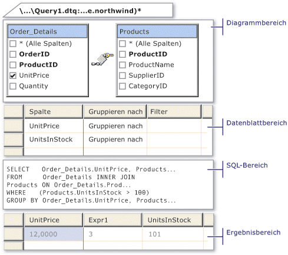

# Tools im Abfrage- und Sicht-Designer (Visual Database Tools)
Beim Entwerfen einer Abfrageergebnis anzuzeigen, in\-Zeile der Funktion oder einem\-Anweisung gespeicherte Prozedur, die im Designer besteht aus vier Bereiche: im Diagrammbereich, den Kriterienbereich, den SQL-Bereich und im Ergebnisbereich.  
  
  
  
-   Der Bereich Diagramm zeigt die Tabellen und andere\-Objekte, die Sie Abfragen bewertet. Jedes Rechteck stellt eine Tabelle oder eine Tabelle\-bewertet-Objekt und zeigt die verfügbaren Datenspalten. Joins werden durch Linien zwischen den Rechtecken angezeigt. Weitere Informationen finden Sie unter [Diagrammbereich & #40; Visual Database Tools & #41;](../content/Diagram-Pane--Visual-Database-Tools-.md).  
  
-   Im Kriterienbereich enthält eine Kalkulationstabelle\-wie Raster, in dem Sie angeben, wie z. B. welche Datenspalten angezeigt, welche Zeilen ausgewählt oder Optionen wie Zeilen gruppiert und so weiter. Weitere Informationen finden Sie unter [im Kriterienbereich & #40; Visual Database Tools & #41;](../content/Criteria-Pane--Visual-Database-Tools-.md).  
  
-   Im SQL-Bereich wird die SQL-Anweisung für die Abfrage oder Sicht angezeigt. Sie können die vom Designer erstellte SQL-Anweisung bearbeiten oder eine eigene SQL-Anweisung eingeben. Dieser Bereich ist besonders hilfreich bei der Eingabe von SQL-Anweisungen, die nicht im Diagramm- oder Kriterienbereich erstellt werden können, z. B. bei Union-Abfragen. Weitere Informationen finden Sie unter [SQL-Bereich & #40; Visual Database Tools & #41;](../content/SQL-Pane--Visual-Database-Tools-.md).  
  
-   Im Ergebnisbereich wird ein Datenblatt mit den in der Abfrage oder Sicht abgerufenen Daten angezeigt. Im Abfrage- und Sicht-Designer enthält dieser Bereich die Ergebnisse der zuletzt ausgeführten SELECT-Abfrage. Sie können die Datenbank durch Bearbeiten der Zellenwerte im Datenblatt ändern, und Sie können Zeilen hinzufügen oder löschen. Weitere Informationen finden Sie unter [im Ergebnisbereich & #40; Visual Database Tools & #41;](../content/Results-Pane--Visual-Database-Tools-.md).  
  
Sie können jeden dieser Bereiche verwenden, um eine Abfrage oder Sicht zu erstellen oder anzuzeigen. Beispielsweise können Sie eine anzuzeigende Spalte im Diagrammbereich auswählen, im Kriterienbereich eingeben oder im SQL-Bereich in eine SQL-Anweisung einbinden.  
  
## Anzeigen und Ausblenden von Bereichen  
Um einen Bereich auszublenden oder einen Bereich, der nicht angezeigt wird, mit der rechten Maustaste\-Klicken Sie auf der Entwurfsoberfläche, zeigen Sie auf **Bereich**, und klicken Sie dann auf den Namen des Bereichs. Wenn der Abfrage- und Ansicht-Designer im Abfrage-Designer-Modus geöffnet wird die **Ergebnisse** Bereich ist nicht verfügbar.  
  
## Siehe auch  
[Entwerfen von Abfragen und Sichten Gewusst-wie-Themen & #40; Visual Database Tools & #41;](../content/Design-Queries-and-Views-How-to-Topics--Visual-Database-Tools-.md)  
[Öffnen Sie die Abfrage und Sicht-Designer & #40. Visual Database Tools & #41;](../content/Open-the-Query-and-View-Designer--Visual-Database-Tools-.md)  
[SQL-Editor & #40; Visual Database Tools & #41;](../content/SQL-Editor--Visual-Database-Tools-.md)  
  
