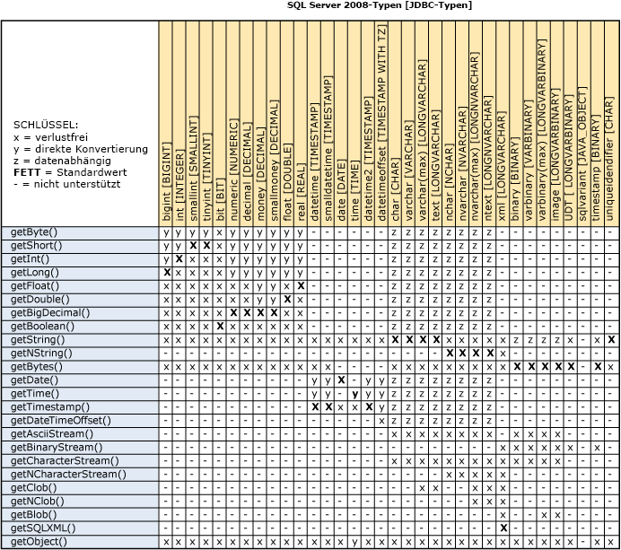
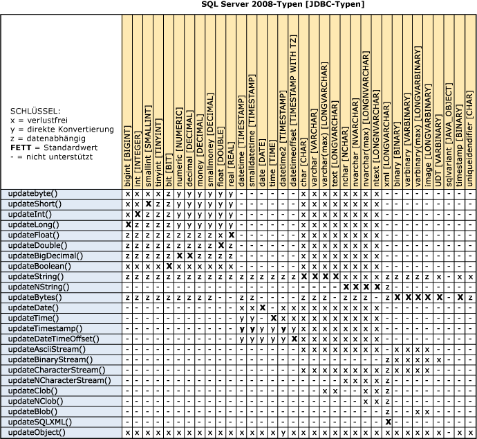
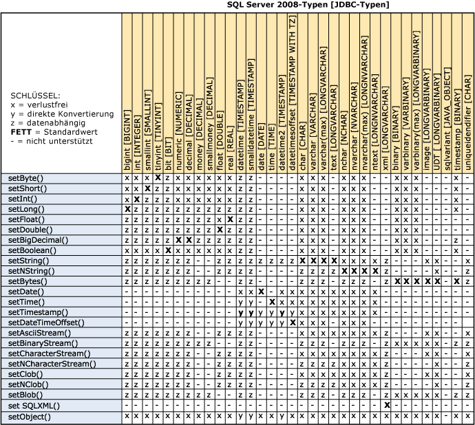
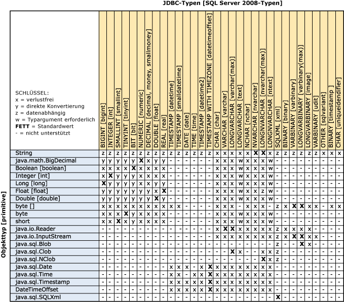

# Grundlegendes zu Datentypkonvertierungen
  Um eine Konvertierung der Datentypen der Programmiersprache Java in [!INCLUDE[ssNoVersion](../content/includes/ssNoVersion_md.md)]\-Datentypen zu ermöglichen, stellt [!INCLUDE[jdbcNoVersion](../content/includes/jdbcNoVersion_md.md)] die erforderlichen Datentypkonvertierungen gemäß der JDBC\-Spezifikation bereit. Alle Typen können in die und aus den Datentypen **Object**, **String** und **byte\[\]** konvertiert werden, um mehr Flexibilität bereitzustellen.  
  
## Konvertierungen für Abrufmethoden  
 Das folgende Diagramm enthält auf Grundlage der [!INCLUDE[ssNoVersion](../content/includes/ssNoVersion_md.md)]\-Datentypen das Konvertierungsschema des JDBC\-Treibers für die get\<Type\>\(\)\-Methoden der [SQLServerResultSet](../content/SQLServerResultSet-Class.md)\-Klasse und die unterstützten Konvertierungen für die get\<Type\>\-Methoden der [SQLServerCallableStatement](../content/SQLServerCallableStatement-Class.md)\-Klasse.  
  
   
  
 Von den Abrufmethoden des JDBC\-Treibers werden drei Konvertierungskategorien unterstützt:  
  
-   **Non\-Lossy \(x\)**: Konvertierungen für Fälle, in denen der Abruftyp maximal dem zugrunde liegenden Servertyp entspricht. Beim Aufruf von getBigDecimal für eine zugrunde liegende dezimale Serverspalte ist beispielsweise keine Konvertierung erforderlich.  
  
-   **Converted \(y\)**: Konvertierungen von numerischen Servertypen zu Java\-Typen, bei denen die Konvertierung entsprechend den Konvertierungsregeln von Java erfolgt. Bei diesen Konvertierungen wird die Genauigkeit gekürzt \(niemals gerundet\), und der Überlauf wird als Modulo des Zieltyps behandelt, der kleiner ist. Beim Aufruf von getInt für eine zugrunde liegende **decimal**\-Spalte mit dem Wert "1,9999" wird der Wert "1" zurückgegeben. Beim zugrunde liegenden **decimal**\-Wert "3000000000" beträgt der Überlauf des **int**\-Werts "\-1294967296".  
  
-   **Data Dependent \(z\)**: Bei Konvertierungen von zugrunde liegenden Datentypen in numerische Typen müssen die Zeichentypen Werte enthalten, die in den betreffenden Typ konvertiert werden können. Andere Konvertierungen werden nicht ausgeführt. Werte, die für den Abruftyp zu groß sind, sind ungültig. Beim Aufruf von getInt für eine varchar\(50\)\-Spalte, die "53" enthält, wird beispielsweise der Wert als **int** zurückgegeben. Bei einem zugrunde liegenden Wert von "xyz" oder "3000000000" wird ein Fehler ausgegeben.  
  
 Wenn getString für einen Spaltendatentyp **binary**, **varbinary**, **varbinary\(max\)** oder **image** aufgerufen wird, wird der Wert als hexadezimaler Zeichenfolgenwert zurückgegeben.  
  
## Konvertierungen für Updatemethoden  
 Für die Java\-Typdaten, die an die update\<Type\>\(\)\-Methoden der [SQLServerResultSet](../content/SQLServerResultSet-Class.md)\-Klasse übergeben werden, gelten die folgenden Konvertierungen.  
  
   
  
 Von den Updatemethoden des JDBC\-Treibers werden drei Konvertierungskategorien unterstützt:  
  
-   **Non\-Lossy \(x\)**: Konvertierungen für Fälle, in denen der Aktualisierungstyp maximal dem zugrunde liegenden Servertyp entspricht. Beim Aufruf von updateBigDecimal für eine zugrunde liegende dezimale Serverspalte ist beispielsweise keine Konvertierung erforderlich.  
  
-   **Converted \(y\)**: Konvertierungen von numerischen Servertypen zu Java\-Typen, bei denen die Konvertierung entsprechend den Konvertierungsregeln von Java erfolgt. Bei diesen Konvertierungen wird die Genauigkeit gekürzt \(niemals gerundet\), und der Überlauf wird als Modulo des \(kleineren\) Zieltyps behandelt. Beim Aufruf von updateDecimal für eine zugrunde liegende **int**\-Spalte mit dem Wert "1,9999" wird der Wert "1" zurückgegeben. Beim zugrunde liegenden **decimal**\-Wert "3000000000" beträgt der Überlauf des **int**\-Werts "\-1294967296".  
  
-   **Data Dependent \(z\)**: Bei Konvertierungen von zugrunde liegenden Quelldatentypen zu Zieldatentypen müssen die enthaltenen Werte zu den Zieltypen konvertiert werden können. Andere Konvertierungen werden nicht ausgeführt. Werte, die für den Abruftyp zu groß sind, sind ungültig. Beispielsweise wird das Update bei einem Aufruf von updateString für eine int\-Spalte, die "53" enthält, erfolgreich ausgeführt. Bei einem zugrunde liegenden String\-Wert von "foo" oder "3000000000" wird ein Fehler ausgelöst.  
  
 Wenn updateString für einen Spaltendatentyp **binary**, **varbinary**, **varbinary\(max\)** oder **image** aufgerufen wird, wird der String\-Wert als hexadezimaler Zeichenfolgenwert behandelt.  
  
 Wenn der Datentyp der [!INCLUDE[ssNoVersion](../content/includes/ssNoVersion_md.md)]\-Spalte **XML** ist, muss der Datenwert gültiges **XML** sein. Beim Aufrufen der Methoden updateBytes, updateBinaryStream oder updateBlob sollte der Datenwert die hexadezimale Zeichenfolgendarstellung der XML\-Zeichen sein. Beispiel:  
  
```  
<hello>world</hello> = 0x3C68656C6C6F3E776F726C643C2F68656C6C6F3E   
```  
  
 Beachten Sie, dass eine Bytereihenfolge\-Marke \(BOM\) erforderlich ist, wenn die XML\-Zeichen in einer bestimmten Zeichencodierung vorliegen.  
  
## Konvertierungen für Festlegungsmethoden  
 Für die Java\-Typdaten, die an die set\<Type\>\(\)\-Methoden der [SQLServerPreparedStatement](../content/SQLServerPreparedStatement-Class.md)\-Klasse und der [SQLServerCallableStatement](../content/SQLServerCallableStatement-Class.md)\-Klasse übergeben werden, gelten die folgenden Konvertierungen.  
  
   
  
 Der Server versucht alle Konvertierungen und gibt bei Fehlern eine Fehlermeldung zurück.  
  
 Wenn der Wert eines **String**\-Datentyps die Länge von **VARCHAR** überschreitet, wird er **LONGVARCHAR** zugeordnet. Entsprechend wird ein **NVARCHAR**, dessen Wert die Länge von **LONGNVARCHAR** überschreitet, **NVARCHAR** zugeordnet. Gleiches gilt für **byte\[\]**. Werte, die länger als **VARBINARY** sind, werden in **LONGVARBINARY** konvertiert.  
  
 Von den Festlegungsmethoden des JDBC\-Treibers werden zwei Konvertierungskategorien unterstützt:  
  
-   **Non\-Lossy \(x\)**: Konvertierungen für numerische Fälle, in denen der Festlegungstyp maximal dem zugrunde liegenden Servertyp entspricht. Beim Aufruf von setBigDecimal für eine zugrunde liegende **decimal**\-Serverspalte ist beispielsweise keine Konvertierung erforderlich. Bei der Umwandlung von numerischen Typen in Zeichentypen wird der Java\-Datentyp **numeric** in **String** konvertiert. Beim Aufruf von setDouble für eine varchar\(50\)\-Spalte mit dem Wert "53" wird beispielsweise in der betreffenden Zielspalte der Zeichenwert "53" erzeugt.  
  
-   **Converted \(y\)**: Konvertierungen eines **numeric**\-Java\-Typs in einen zugrunde liegenden **numeric**\-Servertyp, der kleiner ist. Diese Konvertierung ist regulär und erfolgt entsprechend den [!INCLUDE[ssNoVersion](../content/includes/ssNoVersion_md.md)]\-Konvertierungskonventionen. Die Genauigkeit wird immer gekürzt \(niemals gerundet\). Bei einem Überlauf wird der Fehler ausgegeben, dass die Konvertierung nicht unterstützt wird. Beispielsweise führt updateDecimal mit einem Wert von "1,9999" für eine zugrunde liegende integer\-Spalte zu einer "1" in der Zielspalte. Bei Übergabe von "3000000000" löst der Treiber jedoch einen Fehler aus.  
  
-   **Data Dependent \(z\)**: Konvertierungen von einem **String**\-Java\-Typ in den zugrunde liegenden [!INCLUDE[ssNoVersion](../content/includes/ssNoVersion_md.md)]\-Datentyp hängen von den folgenden Bedingungen ab: Der Treiber sendet den **String**\-Wert an [!INCLUDE[ssNoVersion](../content/includes/ssNoVersion_md.md)], und [!INCLUDE[ssNoVersion](../content/includes/ssNoVersion_md.md)] führt ggf. notwendige Konvertierungen durch. Wenn sendStringParametersAsUnicode auf "true" festgelegt ist und der zugrunde liegende [!INCLUDE[ssNoVersion](../content/includes/ssNoVersion_md.md)]\-Datentyp **image** ist, lässt [!INCLUDE[ssNoVersion](../content/includes/ssNoVersion_md.md)] keine Konvertierung von **nvarchar** in **image** zu und löst eine SQLServerException aus. Wenn sendStringParametersAsUnicode auf "false" festgelegt und der zugrunde liegende [!INCLUDE[ssNoVersion](../content/includes/ssNoVersion_md.md)]\-Datentyp **image** ist, lässt [!INCLUDE[ssNoVersion](../content/includes/ssNoVersion_md.md)] die Konvertierung von **varchar** in **image** zu, und es wird keine Ausnahme ausgelöst.  
  
 [!INCLUDE[ssNoVersion](../content/includes/ssNoVersion_md.md)] führt die Konvertierungen aus und übergibt Fehler bei Problemen wieder an den JDBC\-Treiber.  
  
 Wenn der Datentyp der [!INCLUDE[ssNoVersion](../content/includes/ssNoVersion_md.md)]\-Spalte **XML** ist, muss der Datenwert gültiges **XML** sein. Beim Aufrufen der Methoden updateBytes, updateBinaryStream oder updateBlob sollte der Datenwert die hexadezimale Zeichenfolgendarstellung der XML\-Zeichen sein. Beispiel:  
  
```  
<hello>world</hello> = 0x3C68656C6C6F3E776F726C643C2F68656C6C6F3E   
```  
  
 Beachten Sie, dass eine Bytereihenfolge\-Marke \(BOM\) erforderlich ist, wenn die XML\-Zeichen in einer bestimmten Zeichencodierung vorliegen.  
  
## Konvertierungen für setObject  
  
> [!NOTE]  
>  Microsoft JDBC Driver 4.2 für SQL Server unterstützt JDBC 4.1 und 4.2. Weitere Informationen zu den Datentypzuordnungen und \-konvertierungen für die Versionen 4.1 und 4.2 finden Sie unter [JDBC 4.1-Kompatibilität für den JDBC-Treiber](../content/JDBC-4.1-Compliance-for-the-JDBC-Driver.md) und [JDBC 4.2-Kompatibilität für den JDBC-Treiber](../content/JDBC-4.2-Compliance-for-the-JDBC-Driver.md), zusätzlich zu den unten aufgeführten Informationen.  
  
 Für die Java\-Typdaten, die an die setObject\(\<Type\>\)\-Methoden der [SQLServerPreparedStatement](../content/SQLServerPreparedStatement-Class.md)\-Klasse übergeben werden, gelten die folgenden Konvertierungen.  
  
   
  
 Die setObject\-Methode ohne Angabe eines Zieltyps verwendet die Standardzuordnung. Wenn der Wert eines **String**\-Datentyps die Länge von **VARCHAR** überschreitet, wird er **LONGVARCHAR** zugeordnet. Entsprechend wird ein **NVARCHAR**, dessen Wert die Länge von **LONGNVARCHAR** überschreitet, **NVARCHAR** zugeordnet. Gleiches gilt für **byte\[\]**. Werte, die länger als **VARBINARY** sind, werden in **LONGVARBINARY** konvertiert.  
  
 Von den setObject\-Methoden des JDBC\-Treibers werden drei Konvertierungskategorien unterstützt:  
  
-   **Non\-Lossy \(x\)**: Konvertierungen für numerische Fälle, in denen der Festlegungstyp maximal dem zugrunde liegenden Servertyp entspricht. Beim Aufruf von setBigDecimal für eine zugrunde liegende **decimal**\-Serverspalte ist beispielsweise keine Konvertierung erforderlich. Bei der Umwandlung von numerischen Typen in Zeichentypen wird der Java\-Datentyp **numeric** in **String** konvertiert. Beim Aufruf von setDouble für eine varchar\(50\)\-Spalte mit dem Wert "53" wird beispielsweise in der betreffenden Zielspalte der Zeichenwert "53" erzeugt.  
  
-   **Converted \(y\)**: Konvertierungen eines **numeric**\-Java\-Typs in einen zugrunde liegenden **numeric**\-Servertyp, der kleiner ist. Diese Konvertierung ist regulär und erfolgt entsprechend den [!INCLUDE[ssNoVersion](../content/includes/ssNoVersion_md.md)]\-Konvertierungskonventionen. Die Genauigkeit wird immer gekürzt \(niemals gerundet\). Bei einem Überlauf wird der Fehler ausgegeben, dass die Konvertierung nicht unterstützt wird. Beispielsweise führt updateDecimal mit einem Wert von "1,9999" für eine zugrunde liegende integer\-Spalte zu einer "1" in der Zielspalte. Bei Übergabe von "3000000000" löst der Treiber jedoch einen Fehler aus.  
  
-   **Data Dependent \(z\)**: Konvertierungen von einem **String**\-Java\-Typ in den zugrunde liegenden [!INCLUDE[ssNoVersion](../content/includes/ssNoVersion_md.md)]\-Datentyp hängen von den folgenden Bedingungen ab: Der Treiber sendet den **String**\-Wert an [!INCLUDE[ssNoVersion](../content/includes/ssNoVersion_md.md)], und [!INCLUDE[ssNoVersion](../content/includes/ssNoVersion_md.md)] führt ggf. notwendige Konvertierungen durch. Wenn die Verbindungseigenschaft sendStringParametersAsUnicode auf "true" festgelegt ist und der zugrunde liegende [!INCLUDE[ssNoVersion](../content/includes/ssNoVersion_md.md)]\-Datentyp **image** ist, lässt [!INCLUDE[ssNoVersion](../content/includes/ssNoVersion_md.md)] keine Konvertierung von **nvarchar** in **image** zu und löst eine SQLServerException aus. Wenn sendStringParametersAsUnicode auf "false" festgelegt und der zugrunde liegende [!INCLUDE[ssNoVersion](../content/includes/ssNoVersion_md.md)]\-Datentyp **image** ist, lässt [!INCLUDE[ssNoVersion](../content/includes/ssNoVersion_md.md)] die Konvertierung von **varchar** in **image** zu, und es wird keine Ausnahme ausgelöst.  
  
 [!INCLUDE[ssNoVersion](../content/includes/ssNoVersion_md.md)] führt den Großteil der Festlegungskonvertierungen aus und gibt bei Problemen Fehler an den JDBC\-Treiber zurück. Clientseitige Konvertierungen sind die Ausnahme und werden nur bei **date**\-, **time**\-, **timestamp**\-, **Boolean**\- und **String**\-Werten ausgeführt.  
  
 Wenn der Datentyp der [!INCLUDE[ssNoVersion](../content/includes/ssNoVersion_md.md)]\-Spalte **XML** ist, muss der Datenwert gültiges **XML** sein. Beim Aufrufen der Methoden setObject\(byte\[\], SQLXML\), setObject\(inputStream, SQLXML\) oder setObject\(Blob, SQLXML\) sollte der Datenwert die hexadezimale Zeichenfolgendarstellung der XML\-Zeichen sein. Beispiel:  
  
```  
<hello>world</hello> = 0x3C68656C6C6F3E776F726C643C2F68656C6C6F3E   
```  
  
 Beachten Sie, dass eine Bytereihenfolge\-Marke \(BOM\) erforderlich ist, wenn die XML\-Zeichen in einer bestimmten Zeichencodierung vorliegen.  
  
## Siehe auch  
 [Grundlegendes zu den Datentypen in JDBC Driver](../content/Understanding-the-JDBC-Driver-Data-Types.md)  
  
  